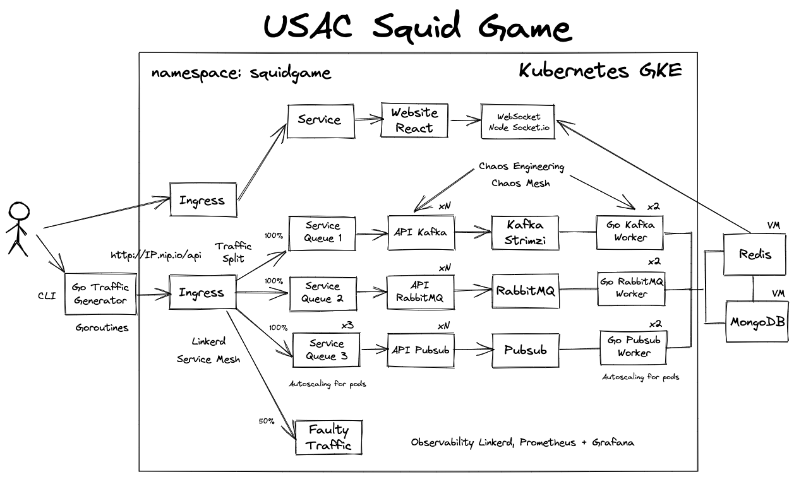

# Sistemas Operativos 1, Segundo Semestre 2021, SquidGame

## Arquitectura
</img>
## Iniciando Cluster
```
gcloud container clusters create proyecto-cluster --num-nodes=3 --tags=all-in,all-out --machine-type=n1-standard-1 --no-enable-network-policy --region=us-central1-a --project={PROJECT-ID}
```
*Nota: all-in y all-out son reglas de firewall que permiten todo el trafico*
### Creando Namespace principal
```
kubectl create namespace squidgame
```

## Instalando NGINX Ingress Controller
```
kubectl create ns nginx-ingress
helm repo add ingress-nginx https://kubernetes.github.io/ingress-nginx 
helm repo update 
helm install nginx-ingress ingress-nginx/ingress-nginx -n nginx-ingress
kubectl get services -n nginx-ingress
```
## Instalando Linkerd
```
curl -fsL https://run.linkerd.io/install | sh
export PATH=$PATH:/home/{YOUR-USER}/.linkerd2/bin
linkerd version
linkerd check --pre
linkerd install | kubectl apply -f -
linkerd check
linkerd viz install | kubectl apply -f -
linkerd check
linkerd viz dashboard
```
## Injectando NGINX ingress-controller
Una correcta inyeccion deberia crear 2 pods
```
kubectl get deployment nginx-ingress-ingress-nginx-controller -n nginx-ingress  -o yaml | linkerd inject - | kubectl apply -f -
kubectl get pods -n nginx-ingress 
```
### Obtener IP de Ingress Load Balancer
Esta IP debe ser remplazada el header *host* de la definicion del Ingress Service llamado *main-ingress*
```
kubectl get svc -n nginx-ingress
```
## Instalando Kafka con Strimzi
Esperaremos a que el servicio de Kafka este arriba
```
kubectl create -f 'https://strimzi.io/install/latest?namespace=squidgame' -n squidgame
kubectl apply -f https://strimzi.io/examples/latest/kafka/kafka-persistent-single.yaml -n squidgame
kubectl wait kafka/my-cluster --for=condition=Ready --timeout=300s -n squidgame
```
## Deploy de Proyecto
```
kubectl apply -f main.yaml -n squidgame
```
## Actualizando Kubectl 
Se debe usar una version de Kubectl =>1.20 para usar Chaos Mesh
```
curl -LO https://dl.k8s.io/release/v1.20.0/bin/linux/amd64/kubectl
sudo install -o root -g root -m 0755 kubectl /usr/local/bin/kubectl
```
## Instalando Chaos Mesh
```
curl -sSL https://mirrors.chaos-mesh.org/v2.0.3/install.sh | bash
```
## Abrir Dashboard
Ester comando debe ser ejecutadod desde nuestra maquina local
```
kubectl port-forward -n chaos-testing svc/chaos-dashboard 2333:2333
```

<h1><a href="Documentacion/Manual_Tecnico.pdf">Manual Técnico</a></h1>
<h1><a href="Documentacion/Manual_Usuario.pdf">Manual de Usuario</a></h1>
<h1><a href="https://github.com/sergioarmgpl/operating-systems-usac-course/blob/master/lang/en/projects/project1v4/project1.md#description">Origen de Proyecto</a></h1>
